# 🎯 DIAGRAMAS Y FLUJOS DEL SISTEMA

## 📊 ARQUITECTURA DEL SISTEMA

```mermaid
graph TB
    subgraph "Frontend (React + TypeScript)"
        A[App.tsx] --> B[Navigation.tsx]
        A --> C[GestionPagos.tsx]
        A --> D[GestionUsuarios.tsx]
        A --> E[Reportes.tsx]
        
        C --> F[CrearPagoModal.tsx]
        C --> G[EditarEstadoModal.tsx]
        C --> H[VerPagosUsuarioModal.tsx]
        
        C --> I[EstadoBadge.tsx]
        D --> I
        E --> I
    end
    
    subgraph "Services Layer"
        J[api.ts] --> K[pagoService]
        J --> L[usuarioService]
    end
    
    subgraph "Backend API"
        M[/api/pagos] 
        N[/api/usuarios]
        O[/api/reportes]
    end
    
    K --> M
    L --> N
    K --> O
    L --> O
    
    C --> J
    D --> J
    E --> J
```

## 🔄 FLUJO DE DATOS PRINCIPALES

### **Flujo de Gestión de Pagos**

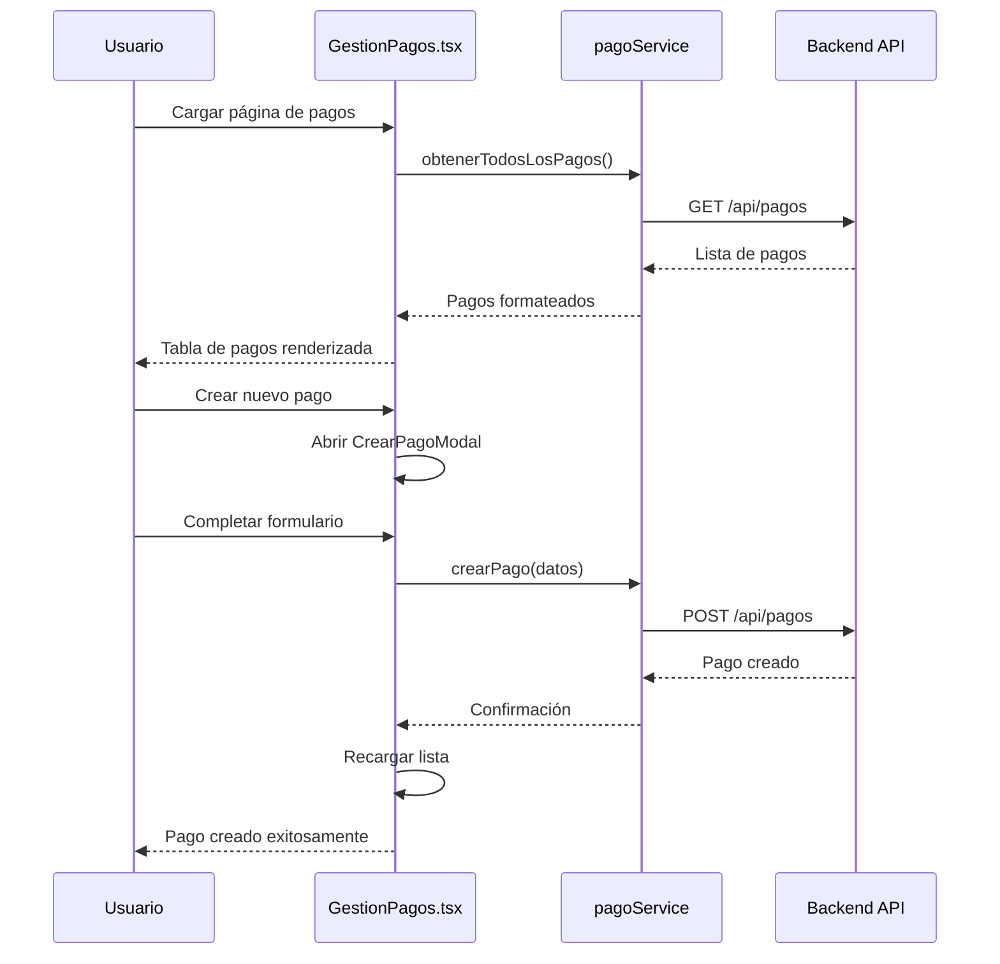

### **Flujo de Filtrado y Búsqueda**

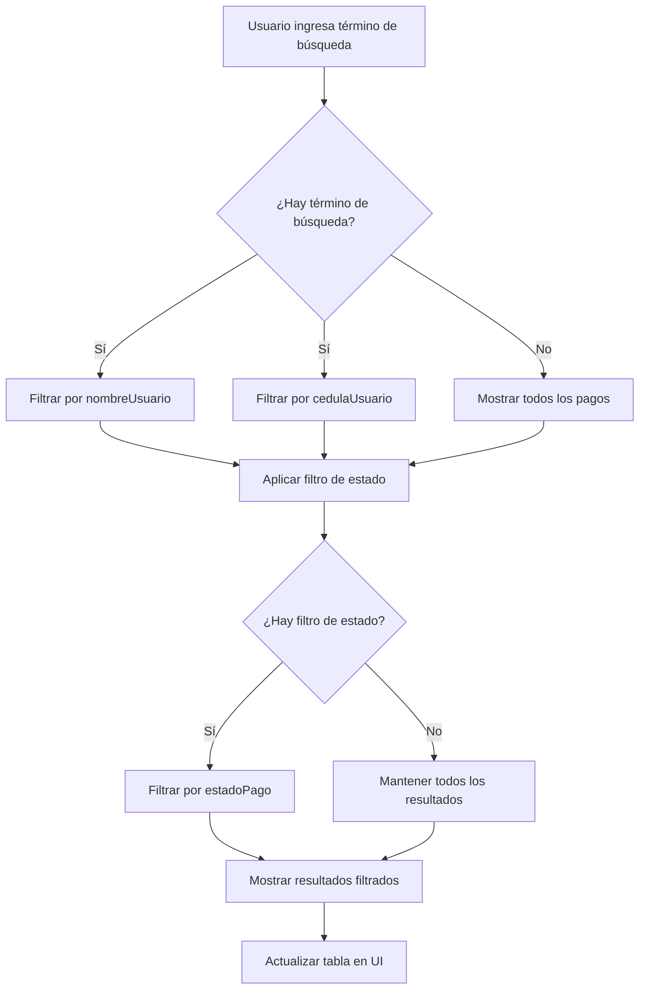

## 🎨 ESTRUCTURA DE COMPONENTES UI

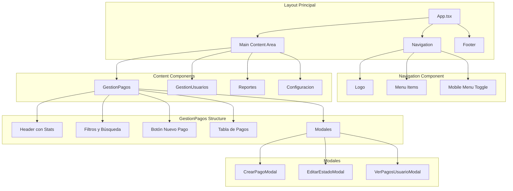

## 🔄 ESTADOS DE LA APLICACIÓN

### **Estados de Carga y Error**

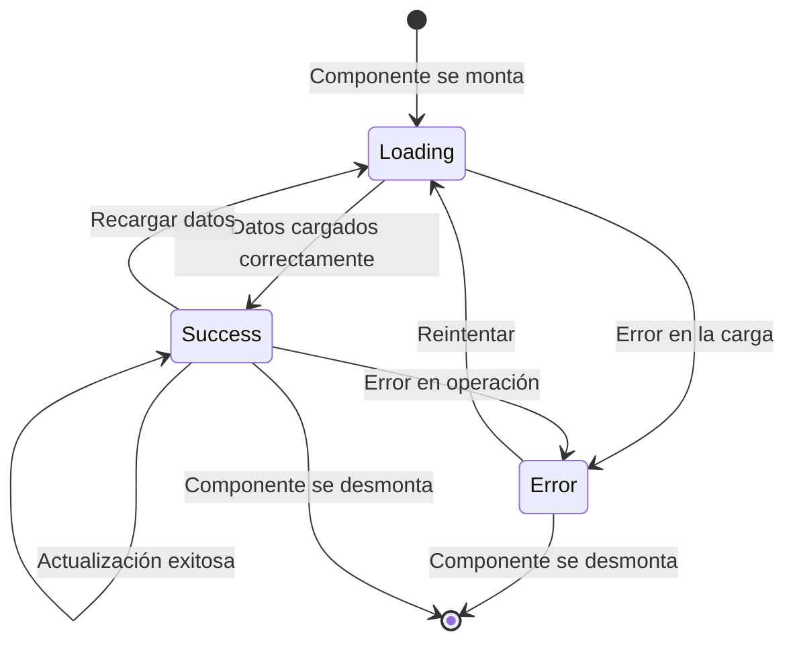

### **Estados de Pago**

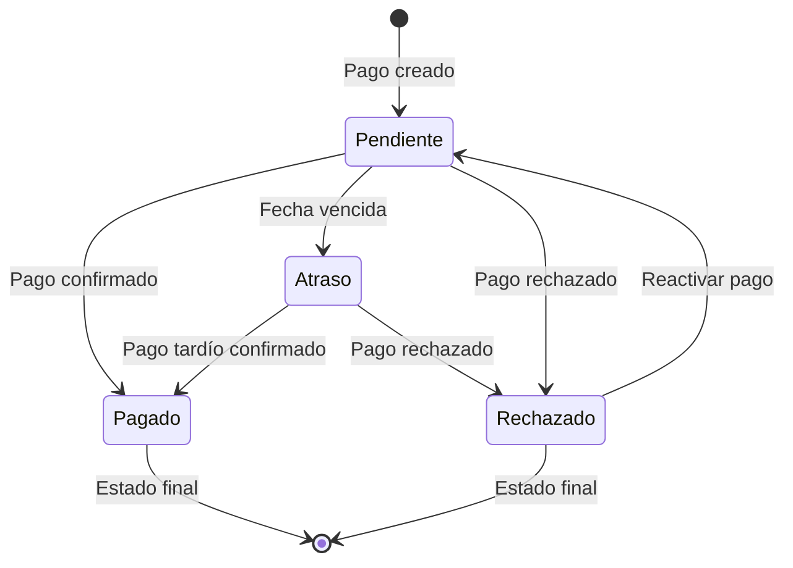

## 📱 RESPONSIVE BREAKPOINTS

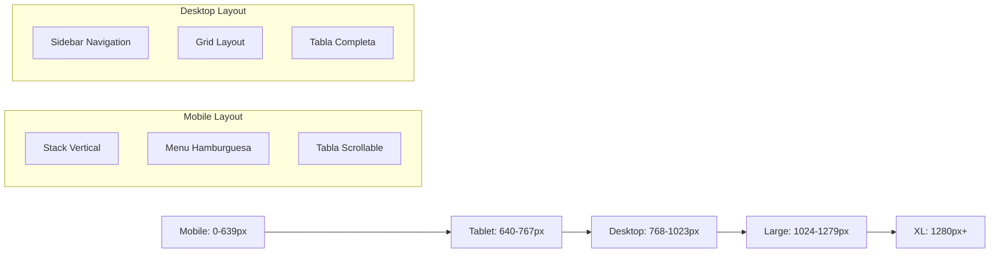

## 🔐 FLUJO DE VALIDACIONES

### **Validación de Formulario de Pago**

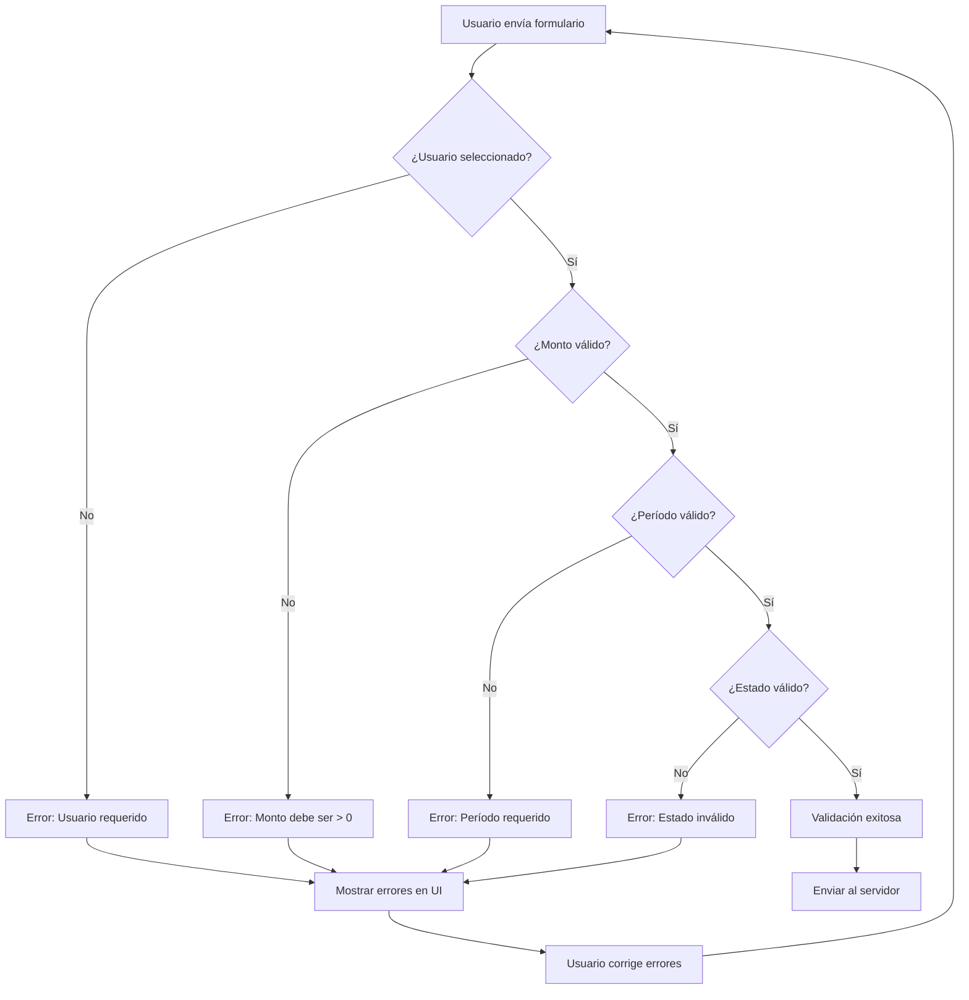

## 📊 ESTRUCTURA DE DATOS EN MEMORIA

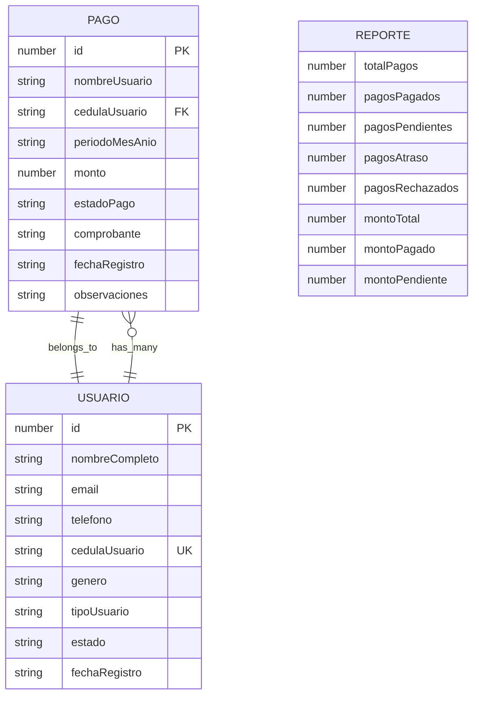

## 🎯 PATRONES DE DISEÑO UTILIZADOS

### **Component Pattern**
```typescript
// Componente funcional con hooks
const GestionPagos: React.FC = () => {
  const [pagos, setPagos] = useState<Pago[]>([]);
  const [loading, setLoading] = useState(true);
  
  useEffect(() => {
    cargarDatos();
  }, []);
  
  return (
    <div className="container">
      {/* JSX */}
    </div>
  );
};
```

### **Service Pattern**
```typescript
// Servicios separados para comunicación con API
export const pagoService = {
  async obtenerTodosLosPagos(): Promise<Pago[]> {
    const response = await api.get('/pagos');
    return response.data;
  },
  
  async crearPago(pagoData: PagoCreateRequest): Promise<PagoResponse> {
    const response = await api.post('/pagos', pagoData);
    return response.data;
  }
};
```

### **Modal Pattern**
```typescript
// Modales reutilizables con props
interface CrearPagoModalProps {
  onClose: () => void;
  onSuccess: () => void;
  usuarios: Usuario[];
}

const CrearPagoModal: React.FC<CrearPagoModalProps> = ({ onClose, onSuccess, usuarios }) => {
  // Lógica del modal
};
```

## 🔍 TESTING STRATEGY

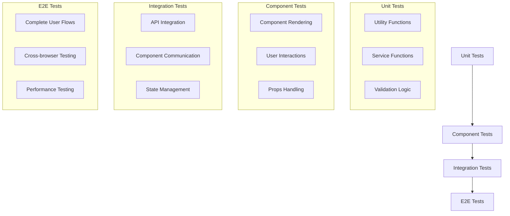

## 🚀 DEPLOYMENT PIPELINE

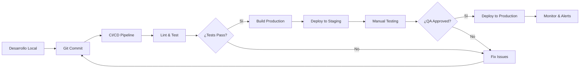

## 📈 PERFORMANCE MONITORING

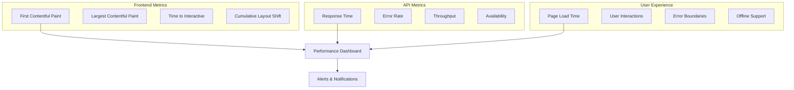

---

*Estos diagramas proporcionan una visión completa de la arquitectura, flujos de datos y patrones utilizados en el sistema.*