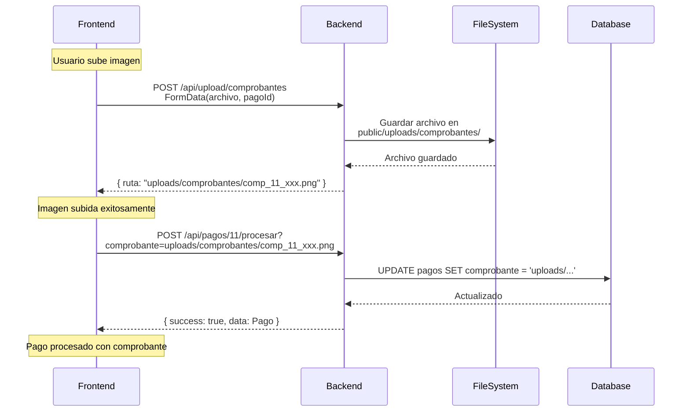

# ✅ FLUJO CORRECTO DE SUBIDA DE ARCHIVOS - IMPLEMENTADO

## 📋 Flujo Completo Implementado



---

## 🔄 Flujo Detallado

### **PASO 1: Frontend Sube la Imagen**

**Request:**
```http
POST http://localhost:8080/api/upload/comprobantes
Content-Type: multipart/form-data

FormData:
  - comprobante: [File objeto]
  - pagoId: 11
```

**Código Frontend:**
```typescript
// En EditarEstadoModal.tsx línea 67-75
if (archivoComprobante) {
  console.log('📤 Subiendo archivo al servidor...');
  
  // ✅ PASO 1: Subir archivo al servidor
  rutaComprobante = await uploadService.subirComprobante(archivoComprobante, pago.id);
  
  console.log('✅ Archivo subido exitosamente. Ruta:', rutaComprobante);
}
```

**Servicio de Upload:**
```typescript
// En api.ts línea 100-113
export const uploadService = {
  async subirComprobante(archivo: File, pagoId: number): Promise<string> {
    const formData = new FormData();
    formData.append('comprobante', archivo);
    formData.append('pagoId', pagoId.toString());

    const response = await api.post<ApiResponse<{ ruta: string }>>(
      '/upload/comprobantes', 
      formData, 
      {
        headers: { 'Content-Type': 'multipart/form-data' }
      }
    );
    
    return response.data.data?.ruta || '';
  }
};
```

---

### **PASO 2: Backend Guarda Archivo y Retorna Ruta**

**Response esperado:**
```json
{
  "success": true,
  "data": {
    "ruta": "uploads/comprobantes/comp_11_1759467978129.png"
  },
  "message": "Comprobante subido exitosamente"
}
```

**Backend (Node.js + Multer):**
```javascript
// routes/upload.js
const express = require('express');
const multer = require('multer');
const path = require('path');
const router = express.Router();

// Configuración de almacenamiento
const storage = multer.diskStorage({
  destination: function (req, file, cb) {
    cb(null, 'public/uploads/comprobantes/');
  },
  filename: function (req, file, cb) {
    const pagoId = req.body.pagoId || 'unknown';
    const timestamp = Date.now();
    const extension = path.extname(file.originalname);
    cb(null, `comp_${pagoId}_${timestamp}${extension}`);
  }
});

const upload = multer({
  storage: storage,
  limits: { fileSize: 5 * 1024 * 1024 }, // 5MB
  fileFilter: (req, file, cb) => {
    if (file.mimetype.startsWith('image/')) {
      cb(null, true);
    } else {
      cb(new Error('Solo se permiten imágenes'));
    }
  }
});

router.post('/comprobantes', upload.single('comprobante'), (req, res) => {
  try {
    if (!req.file) {
      return res.status(400).json({
        success: false,
        data: null,
        message: 'No se recibió ningún archivo'
      });
    }

    const ruta = `uploads/comprobantes/${req.file.filename}`;
    
    console.log('✅ Archivo guardado:', ruta);
    
    res.json({
      success: true,
      data: { ruta },
      message: 'Comprobante subido exitosamente'
    });
  } catch (error) {
    console.error('Error al subir comprobante:', error);
    res.status(500).json({
      success: false,
      data: null,
      message: 'Error al subir el archivo'
    });
  }
});

module.exports = router;
```

**Backend (Spring Boot + MultipartFile):**
```java
@RestController
@RequestMapping("/api/upload")
public class UploadController {

    @PostMapping("/comprobantes")
    public ResponseEntity<?> subirComprobante(
        @RequestParam("comprobante") MultipartFile file,
        @RequestParam("pagoId") Long pagoId
    ) {
        try {
            if (file.isEmpty()) {
                return ResponseEntity.badRequest().body(
                    new ApiResponse<>(false, null, "No se recibió ningún archivo")
                );
            }

            // Validar tipo de archivo
            String contentType = file.getContentType();
            if (contentType == null || !contentType.startsWith("image/")) {
                return ResponseEntity.badRequest().body(
                    new ApiResponse<>(false, null, "Solo se permiten imágenes")
                );
            }

            // Crear directorio si no existe
            String uploadDir = "public/uploads/comprobantes/";
            File directory = new File(uploadDir);
            if (!directory.exists()) {
                directory.mkdirs();
            }

            // Generar nombre único
            long timestamp = System.currentTimeMillis();
            String extension = file.getOriginalFilename().substring(
                file.getOriginalFilename().lastIndexOf(".")
            );
            String filename = "comp_" + pagoId + "_" + timestamp + extension;

            // Guardar archivo
            String filePath = uploadDir + filename;
            file.transferTo(new File(filePath));

            // Ruta relativa para guardar en BD
            String ruta = "uploads/comprobantes/" + filename;
            
            System.out.println("✅ Archivo guardado: " + ruta);

            Map<String, String> data = new HashMap<>();
            data.put("ruta", ruta);

            return ResponseEntity.ok(
                new ApiResponse<>(true, data, "Comprobante subido exitosamente")
            );

        } catch (Exception e) {
            System.err.println("❌ Error al subir comprobante: " + e.getMessage());
            return ResponseEntity.status(500).body(
                new ApiResponse<>(false, null, "Error al subir el archivo: " + e.getMessage())
            );
        }
    }
}
```

---

### **PASO 3: Frontend Procesa el Pago con la Ruta**

**Request:**
```http
POST http://localhost:8080/api/pagos/11/procesar?monto=50000&metodoPago=transferencia&comprobante=uploads/comprobantes/comp_11_1759467978129.png&observaciones=Pago%20verificado
```

**Código Frontend:**
```typescript
// En EditarEstadoModal.tsx línea 78-87
if (nuevoEstado === 'pagado') {
  console.log('💳 Procesando pago con comprobante:', rutaComprobante);
  
  // ✅ PASO 2: Procesar pago con la ruta del comprobante
  const datosPago: PagoProcesarRequest = {
    monto: pago.monto,
    metodoPago: metodoPago || 'efectivo',
    comprobante: rutaComprobante || undefined, // ⬅️ Ruta obtenida del upload
    observaciones: observaciones || undefined
  };
  await pagoService.procesarPago(pago.id, datosPago);
  
  console.log('✅ Pago procesado exitosamente');
}
```

---

### **PASO 4: Backend Guarda la Ruta en la Base de Datos**

**SQL ejecutado:**
```sql
UPDATE pagos 
SET 
  estado = 'pagado',
  monto = 50000,
  metodo_pago = 'transferencia',
  comprobante = 'uploads/comprobantes/comp_11_1759467978129.png', -- ⬅️ RUTA GUARDADA
  observaciones = 'Pago verificado',
  fecha_pago = NOW()
WHERE id = 11;
```

**Response:**
```json
{
  "success": true,
  "data": {
    "id": 11,
    "usuarioId": 1,
    "estado": "pagado",
    "monto": 50000,
    "metodoPago": "transferencia",
    "comprobante": "uploads/comprobantes/comp_11_1759467978129.png",
    "observaciones": "Pago verificado",
    "fechaPago": "2025-10-03T05:30:00.000Z"
  },
  "message": "Pago procesado correctamente"
}
```

---

## 🎯 Ventajas del Flujo Implementado

### ✅ **Separación de Responsabilidades**
- Endpoint `/upload/comprobantes` → Solo maneja upload de archivos
- Endpoint `/pagos/{id}/procesar` → Solo maneja lógica de negocio

### ✅ **Manejo de Errores Robusto**
- Si falla el upload → No se procesa el pago
- Si falla procesar → El archivo ya está guardado (se puede referenciar)

### ✅ **Validación en Dos Niveles**
- Frontend valida tipo y tamaño antes de subir
- Backend valida nuevamente antes de guardar

### ✅ **Escalabilidad**
- El endpoint de upload se puede reutilizar para otros documentos
- Fácil agregar validaciones adicionales (virus scan, compresión, etc.)

---

## 🧪 Prueba del Flujo Completo

### **1. Preparar Backend**

#### Node.js:
```bash
npm install multer
```

Crear `routes/upload.js` con el código provisto arriba.

En `app.js`:
```javascript
const uploadRoutes = require('./routes/upload');
app.use('/api/upload', uploadRoutes);
app.use('/uploads', express.static('public/uploads'));
```

#### Spring Boot:
```xml
<!-- No necesita dependencias adicionales, MultipartFile viene con Spring -->
```

Crear `UploadController.java` con el código provisto arriba.

En `application.properties`:
```properties
spring.servlet.multipart.max-file-size=5MB
spring.servlet.multipart.max-request-size=5MB
```

---

### **2. Crear Directorio**

```bash
mkdir -p public/uploads/comprobantes
```

---

### **3. Probar desde el Frontend**

1. Abre `http://localhost:5174`
2. Ve a **Gestión de Pagos**
3. Click en 👁️ de un usuario
4. Selecciona un pago **Pendiente**
5. Click en ✏️ **Editar**
6. Cambia estado a **"Pagado"**
7. Llena:
   - Método: `transferencia`
   - **Comprobante: SUBE UNA IMAGEN** 📸
   - Observaciones: `Pago de prueba`
8. Click en **Guardar**

---

### **4. Verificar en Consola del Navegador**

```
📤 Subiendo archivo al servidor...
✅ Archivo subido exitosamente. Ruta: uploads/comprobantes/comp_11_1759467978129.png
💳 Procesando pago con comprobante: uploads/comprobantes/comp_11_1759467978129.png
✅ Pago procesado exitosamente
```

---

### **5. Verificar en Consola del Backend**

```
✅ Archivo guardado: uploads/comprobantes/comp_11_1759467978129.png
===== PROCESAR PAGO =====
ID Pago: 11
Comprobante: uploads/comprobantes/comp_11_1759467978129.png
✅ Pago procesado - Comprobante guardado: uploads/comprobantes/comp_11_1759467978129.png
```

---

### **6. Verificar en FileSystem**

```bash
ls public/uploads/comprobantes/
# Debería mostrar: comp_11_1759467978129.png
```

---

### **7. Verificar en Base de Datos**

```sql
SELECT id, estado, comprobante FROM pagos WHERE id = 11;
```

**Resultado esperado:**
```
id | estado | comprobante
11 | pagado | uploads/comprobantes/comp_11_1759467978129.png
```

---

### **8. Verificar en el Frontend (Modal Ver)**

1. Vuelve a la lista de pagos del usuario
2. El pago ahora tiene botón **👁️ Ver**
3. Click en **👁️ Ver**
4. **Deberías ver la imagen del comprobante** 🖼️
5. Click en "Ver imagen en tamaño completo" abre: `http://localhost:8080/uploads/comprobantes/comp_11_1759467978129.png`

---

## 📊 Comparación: Antes vs Ahora

### ❌ **ANTES (Incorrecto)**

```typescript
// ❌ Solo generaba una ruta, NO subía el archivo
const timestamp = new Date().getTime();
rutaComprobante = `uploads/comprobantes/comp_${pago.id}_${timestamp}.jpg`;
// El archivo NUNCA se enviaba al servidor
```

**Resultado:**
- ❌ Archivo NO existe en el servidor
- ❌ Ruta guardada en BD apunta a un archivo inexistente
- ❌ Al abrir el modal de detalle, imagen no carga (404)

---

### ✅ **AHORA (Correcto)**

```typescript
// ✅ Sube el archivo PRIMERO, obtiene la ruta REAL
if (archivoComprobante) {
  rutaComprobante = await uploadService.subirComprobante(archivoComprobante, pago.id);
  // Archivo YA está guardado en: public/uploads/comprobantes/comp_11_xxx.png
}

// ✅ Procesa el pago con la ruta REAL
await pagoService.procesarPago(pago.id, { comprobante: rutaComprobante });
```

**Resultado:**
- ✅ Archivo SÍ existe en el servidor
- ✅ Ruta guardada en BD apunta al archivo real
- ✅ Al abrir el modal de detalle, imagen carga correctamente

---

## 🚨 Errores Comunes y Soluciones

### Error 1: "No se recibió ningún archivo"

**Causa:** Backend no recibe el FormData correctamente.

**Solución:**
- Verifica que el nombre del campo sea exactamente `comprobante`
- Verifica que el backend use `multer.single('comprobante')` o `@RequestParam("comprobante")`

---

### Error 2: "CORS error al subir archivo"

**Causa:** CORS no permite multipart/form-data.

**Solución:**
```javascript
app.use(cors({
  origin: 'http://localhost:5174',
  credentials: true,
  methods: ['GET', 'POST', 'PUT', 'DELETE', 'PATCH', 'OPTIONS'],
  allowedHeaders: ['Content-Type', 'Authorization', 'multipart/form-data']
}));
```

---

### Error 3: "Error 413 Payload Too Large"

**Causa:** Archivo supera el límite permitido.

**Solución:**

**Node.js:**
```javascript
app.use(express.json({ limit: '10mb' }));
app.use(express.urlencoded({ limit: '10mb', extended: true }));
```

**Spring Boot:**
```properties
spring.servlet.multipart.max-file-size=10MB
spring.servlet.multipart.max-request-size=10MB
```

---

### Error 4: Imagen no carga en el modal (404)

**Causa:** Backend no sirve archivos estáticos.

**Solución:**

**Node.js:**
```javascript
app.use('/uploads', express.static('public/uploads'));
```

**Spring Boot:**
```java
@Configuration
public class WebConfig implements WebMvcConfigurer {
    @Override
    public void addResourceHandlers(ResourceHandlerRegistry registry) {
        registry.addResourceHandler("/uploads/**")
                .addResourceLocations("file:public/uploads/");
    }
}
```

---

## ✅ Checklist de Implementación

### Frontend (✅ COMPLETADO)
- [x] Servicio `uploadService.subirComprobante()` creado
- [x] `handleSubmit` actualizado para subir archivo primero
- [x] Logs de debugging agregados
- [x] Manejo de errores implementado
- [x] Import de `uploadService` agregado

### Backend (⚠️ PENDIENTE)
- [ ] Endpoint `/api/upload/comprobantes` implementado
- [ ] Multer (Node.js) o MultipartFile (Spring) configurado
- [ ] Directorio `public/uploads/comprobantes/` creado
- [ ] Archivos estáticos configurados (`/uploads`)
- [ ] Validación de tipo y tamaño implementada
- [ ] Response con formato `{ ruta: string }` implementado

### Pruebas (⏳ PENDIENTE)
- [ ] Probar upload desde el frontend
- [ ] Verificar archivo guardado en FileSystem
- [ ] Verificar ruta guardada en BD
- [ ] Verificar imagen se muestra en modal de detalle
- [ ] Probar con imágenes de diferentes formatos (jpg, png, webp)
- [ ] Probar con archivo > 5MB (debe rechazar)

---

## 🎯 Próximos Pasos

1. **Implementa el endpoint de backend** siguiendo el código provisto
2. **Crea el directorio** `public/uploads/comprobantes/`
3. **Configura archivos estáticos** para servir las imágenes
4. **Prueba el flujo completo** subiendo una imagen
5. **Verifica** que la imagen se muestre en el modal de detalle

---

## 📚 Documentación Relacionada

- `GUIA-BACKEND-UPLOAD.md` - Guía detallada para implementar el backend
- `CONFIGURACION-CORS-BACKEND.md` - Configuración de CORS
- `FUNCIONALIDAD-VER-DETALLE.md` - Modal de detalle del pago
- `BACKEND-GUARDAR-COMPROBANTE.md` - Cómo asegurar que se guarda en BD

---

## 📝 Resumen

### ✅ **Flujo Confirmado e Implementado:**

1. ✅ Frontend sube imagen → `POST /api/upload/comprobantes`
2. ✅ Backend guarda archivo y retorna ruta: `uploads/comprobantes/comp_11_xxx.png`
3. ✅ Frontend procesa pago → `POST /api/pagos/11/procesar` con la ruta
4. ✅ Backend guarda la ruta en el campo `comprobante` de la tabla `pagos`

**Estado:** Frontend implementado ✅ | Backend pendiente ⚠️
