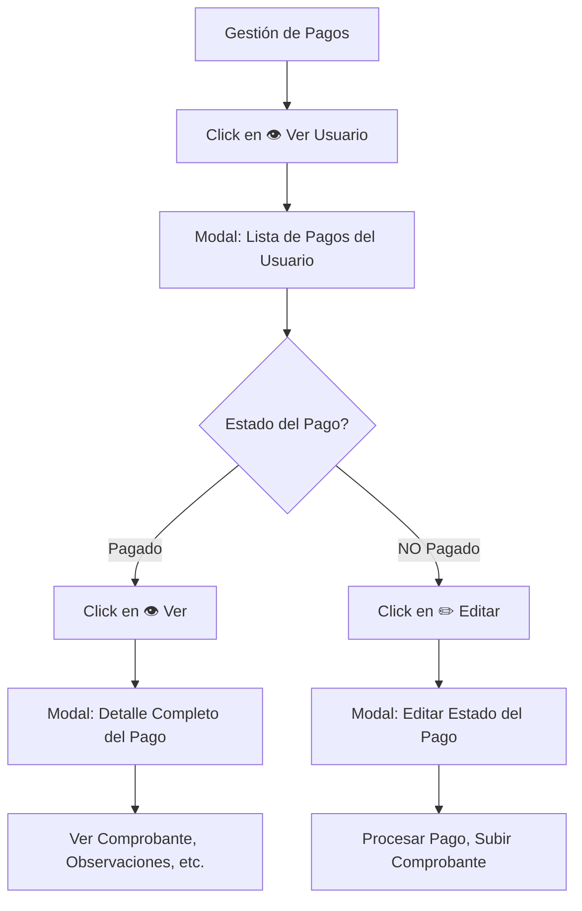

# 📋 Resumen: Ver Detalle de Pagos + Guardar Comprobante

## ✅ Implementado en el Frontend

### 1. **Nuevo Modal: Ver Detalle del Pago**

```
┌─────────────────────────────────────────┐
│  📄 Detalle del Pago - ID: 11          │
│  ─────────────────────────────────────  │
│                                         │
│  🟢 PAGADO                              │
│                                         │
│  👤 Información del Usuario             │
│  ├─ Nombre: Juan Pérez                 │
│  └─ ID: 1                               │
│                                         │
│  📅 Período: Mayo 2025                  │
│  💰 Monto: $50,000                      │
│  💳 Método: Transferencia               │
│  📆 Fecha Pago: 03/10/2025              │
│                                         │
│  📝 Observaciones: Pago verificado      │
│                                         │
│  🖼️ Comprobante:                        │
│  ┌─────────────────────┐                │
│  │                     │                │
│  │  [Imagen Preview]   │                │
│  │                     │                │
│  └─────────────────────┘                │
│  [Ver en tamaño completo]               │
│                                         │
│  [Cerrar]                               │
└─────────────────────────────────────────┘
```

### 2. **Actualización: Lista de Pagos del Usuario**

**ANTES:**
```
Pago Mayo 2025    🟢 PAGADO    $50,000    [✏️ Editar] [🗑️ Eliminar]
```

**DESPUÉS:**
```
Pago Mayo 2025    🟢 PAGADO    $50,000    [👁️ Ver] [🗑️ Eliminar]
Pago Junio 2025   🟡 PENDIENTE $50,000    [✏️ Editar] [🗑️ Eliminar]
```

**Lógica:**
- ✅ Si `estado === 'pagado'` → Botón **👁️ Ver** (abre modal de detalle)
- ✅ Si `estado !== 'pagado'` → Botón **✏️ Editar** (abre modal de edición)

---

## 🔧 Archivos Modificados/Creados

### Creados:
1. ✅ `src/components/modals/VerDetallePagoModal.tsx` (nuevo)
2. ✅ `FUNCIONALIDAD-VER-DETALLE.md` (documentación)
3. ✅ `RESUMEN-VER-DETALLE.md` (este archivo)

### Modificados:
1. ✅ `src/types/index.ts` - Agregado `fechaCreacion`, `fechaActualizacion`
2. ✅ `src/components/GestionPagos.tsx` - Importado modal, agregado handler
3. ✅ `src/components/modals/VerPagosUsuarioModal.tsx` - Botón Ver/Editar condicional

---

## 🎯 Flujo de Usuario



---

## 🐛 Problema: Comprobante NO se Guarda en BD

### Diagnóstico

El frontend **SÍ envía** el comprobante:

```http
POST /api/pagos/11/procesar?monto=50000&metodoPago=transferencia&comprobante=uploads/comprobantes/comp_11_1234567890.jpg
```

✅ **Confirmado en**: `src/services/api.ts` línea 79-81
```typescript
if (datosPago.comprobante) {
  params.append('comprobante', datosPago.comprobante);
}
```

### Verificación Requerida en Backend

#### 1. **Controlador debe recibir el parámetro**

```java
@PostMapping("/{id}/procesar")
public ResponseEntity<?> procesarPago(
    @PathVariable Long id,
    @RequestParam Double monto,
    @RequestParam String metodoPago,
    @RequestParam(required = false) String comprobante, // ⬅️ VERIFICAR
    @RequestParam(required = false) String observaciones
) {
    System.out.println("Comprobante recibido: " + comprobante); // DEBUG
    // ...
}
```

**Verifica en logs**: `Comprobante recibido: uploads/comprobantes/comp_11_...`

#### 2. **Servicio debe guardarlo**

```java
public Pago procesarPago(Long id, Double monto, String metodoPago, 
                         String comprobante, String observaciones) {
    Pago pago = pagoRepository.findById(id).orElseThrow();
    
    pago.setEstado("pagado");
    pago.setMonto(monto);
    pago.setMetodoPago(metodoPago);
    pago.setComprobante(comprobante); // ⬅️ ASEGURAR QUE SE ASIGNA
    pago.setObservaciones(observaciones);
    pago.setFechaPago(new Date());
    
    Pago saved = pagoRepository.save(pago);
    System.out.println("Guardado - Comprobante: " + saved.getComprobante()); // DEBUG
    
    return saved;
}
```

#### 3. **Base de datos debe reflejarlo**

```sql
SELECT id, estado, comprobante, metodo_pago 
FROM pagos 
WHERE id = 11;
```

**Resultado esperado**:
```
id | estado  | comprobante                                     | metodo_pago
11 | pagado  | uploads/comprobantes/comp_11_1234567890.jpg     | transferencia
```

---

## 🔍 Checklist de Debugging

### Frontend (Ya Verificado ✅)
- [x] El comprobante se genera en `EditarEstadoModal.tsx`
- [x] Se envía en query params en `api.ts`
- [x] Se muestra en el modal de detalle
- [x] Request HTTP incluye el parámetro `comprobante`

### Backend (PENDIENTE DE VERIFICAR ⚠️)
- [ ] El controlador recibe el parámetro `comprobante` (no es `null`)
- [ ] El servicio asigna el valor con `setComprobante()`
- [ ] El repositorio guarda la entidad correctamente
- [ ] La base de datos muestra el valor en la columna `comprobante`

### Posibles Causas si NO se Guarda:

#### Causa 1: El parámetro llega como NULL
**Solución**: Agregar `@RequestParam(value = "comprobante", required = false)`

#### Causa 2: El setter no se ejecuta
**Solución**: Agregar log antes y después de `setComprobante()`

#### Causa 3: La transacción no se confirma
**Solución**: Verificar `@Transactional` en el servicio

#### Causa 4: La columna no existe en BD
**Solución**: Verificar schema de la tabla `pagos`

---

## 🧪 Prueba Manual

### Paso a Paso:

1. **Abre el frontend**: `http://localhost:5174`
2. **Ve a Gestión de Pagos**
3. **Click en 👁️ de un usuario**
4. **Selecciona un pago pendiente**
5. **Click en ✏️ Editar**
6. **Cambia estado a "Pagado"**
7. **Llena**:
   - Método: `transferencia`
   - Comprobante: (deja texto por ahora o sube imagen)
   - Observaciones: `Pago de prueba`
8. **Click en Guardar**
9. **Verifica en el navegador (Network tab)**:
   ```
   POST /api/pagos/X/procesar?monto=50000&metodoPago=transferencia&comprobante=uploads/...
   ```
10. **Verifica en backend logs**:
    ```
    Comprobante recibido: uploads/comprobantes/...
    Guardado - Comprobante: uploads/comprobantes/...
    ```
11. **Verifica en BD**:
    ```sql
    SELECT comprobante FROM pagos WHERE id = X;
    ```
12. **Vuelve al frontend**
13. **Click en 👁️ Ver** del pago procesado
14. **Verifica que se muestra** toda la información

---

## 📊 Comparación Visual

### Modal de Lista (VerPagosUsuarioModal)

**Pago Pagado:**
```
┌────────────────────────────────────────────────────┐
│ 📅 Mayo 2025         🟢 PAGADO                    │
│ Monto: $50,000      Fecha: 03/10/2025             │
│                                        [👁️] [🗑️]  │
└────────────────────────────────────────────────────┘
```

**Pago Pendiente:**
```
┌────────────────────────────────────────────────────┐
│ 📅 Junio 2025        🟡 PENDIENTE                 │
│ Monto: $50,000      Fecha: 01/06/2025             │
│                                        [✏️] [🗑️]  │
└────────────────────────────────────────────────────┘
```

### Modal de Detalle (VerDetallePagoModal)

```
┌────────────────────────────────────────────────────┐
│ 📄 Detalle del Pago                         [✖️]  │
├────────────────────────────────────────────────────┤
│                                                    │
│ Estado: 🟢 PAGADO                                  │
│                                                    │
│ ┌──────────────────────────────────────────────┐  │
│ │ 👤 Información del Usuario                   │  │
│ │ ├─ Nombre: Juan Pérez                        │  │
│ │ └─ ID Usuario: 1                             │  │
│ └──────────────────────────────────────────────┘  │
│                                                    │
│ Detalles del Pago:                                │
│ ├─ 📅 Período: Mayo 2025                          │
│ ├─ 💰 Monto: $50,000                              │
│ ├─ 💳 Método: Transferencia                       │
│ ├─ 📆 Fecha Vencimiento: 30/05/2025               │
│ └─ 📆 Fecha Pago: 03/10/2025                      │
│                                                    │
│ 📝 Observaciones:                                  │
│ ┌──────────────────────────────────────────────┐  │
│ │ Pago verificado por transferencia bancaria   │  │
│ └──────────────────────────────────────────────┘  │
│                                                    │
│ 🖼️ Comprobante de Pago:                           │
│ ┌──────────────────────────────────────────────┐  │
│ │          [Imagen del Comprobante]            │  │
│ │                                              │  │
│ └──────────────────────────────────────────────┘  │
│ [🔗 Ver imagen en tamaño completo]                │
│                                                    │
│                                      [Cerrar]      │
└────────────────────────────────────────────────────┘
```

---

## 🚀 Estado Actual

### ✅ Completado:
- Frontend para ver detalle de pagos
- Botón condicional Ver/Editar
- Preview de comprobante en modal
- Envío de comprobante al backend
- Documentación completa

### ⚠️ Pendiente:
- Verificar guardado en base de datos
- Implementar upload real de archivos (opcional, ver `GUIA-BACKEND-UPLOAD.md`)
- Configurar archivos estáticos en backend (para servir imágenes)

### 📝 Siguiente Acción:
**Agregar logs en el backend y verificar que el comprobante se guarda en la BD**

```java
// En el controlador
System.out.println("✅ Comprobante recibido: " + comprobante);

// En el servicio
System.out.println("✅ Comprobante a guardar: " + pago.getComprobante());
System.out.println("✅ Comprobante guardado: " + savedPago.getComprobante());
```

Luego ejecuta:
```sql
SELECT id, estado, comprobante FROM pagos WHERE id = [ID_DEL_PAGO];
```
